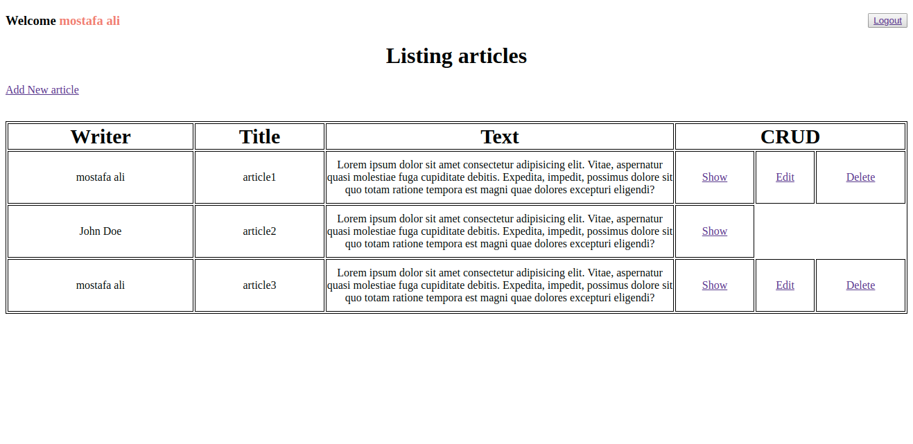
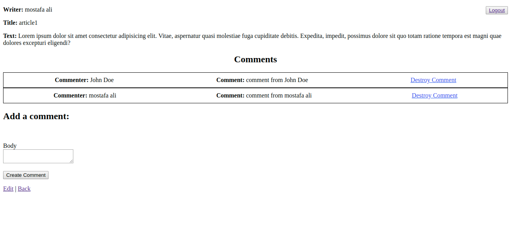

# Rails_blog

- A simple Blog web application that handles all the CRUD operations on a blog using Ruby-on-Rails. 
- The App handles also the User Authentication and Authorization.
---------------------------------------------------------------------------------------------------

---------------------------------------------------------------------------------------------------

